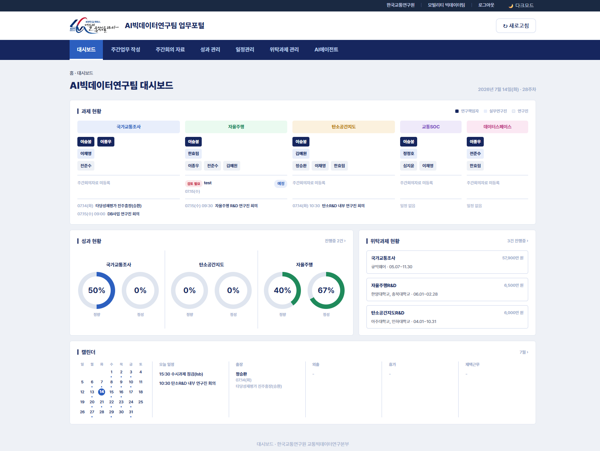

# 🚦 AI빅데이터연구팀 업무포털

> 한국교통연구원 교통빅데이터본부 AI빅데이터연구팀이 매일 여는 그 사이트


노션에 흩어져 있던 일정·회의록·성과·위탁과제를 한곳에 몰아넣고, 두레이 캘린더까지 실시간으로 끌어와서
"오늘 누가 출장 갔더라?" 를 3초 안에 확인할 수 있게 만든 사내 업무포털입니다.

---

## 🖥️ 미리보기



*(대시보드 하나만 봐도 오늘 우리 팀 상황이 다 보여요)*

---

## 🧭 페이지 한눈에 보기

| 페이지 | 뭐 하는 곳이냐면 |
|---|---|
| 🏠 **대시보드** | 과제 현황 · 성과 · 위탁과제 · 캘린더를 한 화면에 때려박은 첫 화면 |
| 📝 **주간업무 작성** | PDF 하나 던지면 업무실적·업무계획이 알아서 채워짐 (신기함) |
| 📅 **주간회의 자료** | 과제별 주간회의 안건 정리 + 코멘트 |
| 📊 **성과 관리** | 정량·정성·추가 성과를 체크리스트로 관리, 다 체크하면 자동 완료 |
| 🗓️ **일정관리** | 두레이 팀 캘린더 그대로, 출장·휴가·재택 근태까지 한눈에 |
| 🤝 **위탁과제 관리** | 위탁업체 회의록 + 요청자료(그림 첨부 포함!) 정리 |
| 🤖 **AI에이전트** | 우리 팀 전용 Claude 에이전트 모음 (11명 근무 중) |
| 📖 **가이드** | 이 사이트 사용법 (당신이 지금 이 README 읽는 이유와 비슷함) |

---

## 🔧 이게 어떻게 돌아가냐면

```
브라우저 ──▶ GitHub Pages (정적 HTML)
              │
              ▼
        Cloudflare Worker (notion-proxy)
              │
      ┌───────┼────────┐
      ▼       ▼        ▼
   Notion   Dooray   (인증)
   (DB)   (팀 캘린더)  로그인
```

- **프론트엔드**: 순수 HTML/CSS/JS (프레임워크 없음, 빌드 없음, 그냥 열면 됨)
- **백엔드**: Cloudflare Worker 하나가 노션 API 프록시 + 두레이 연동 + 인증까지 전부 담당
- **데이터**: 노션 DB (성과/위탁과제/회의자료 등) + 두레이 캘린더 + 자동 아카이브
- **로그인**: 팀 공용 계정 하나로 접근 장벽 수준 (그 이상도 이하도 아님, 정직하게 말씀드림)

---

## 📂 폴더 구조

```
├─ index.html              대시보드
├─ weekly-work.html        주간업무 작성
├─ weekly-meeting.html     주간회의 자료
├─ performance.html        성과 관리
├─ schedule.html           일정관리
├─ outsourced.html         위탁과제 관리
├─ guide.html              사용 가이드
├─ login.html              로그인
├─ index_aiagent.html      AI에이전트 허브
├─ agents/                 에이전트별 상세 페이지 (11명 × 라이트/다크)
├─ worker.js               Cloudflare Worker (노션 프록시 + 두레이 연동)
└─ assets/                 로고, 스크린샷 등
```

---

## ✅ 지금까지 살아남은 기능들

- [x] 노션 DB 연동 (과제/성과/회의/위탁과제)
- [x] 두레이 팀 캘린더 실시간 연동 + 매일 자동 아카이브
- [x] 일정 유형(출장/과제 등) 수동 지정 오버라이드
- [x] PDF → 업무실적/업무계획 자동 추출
- [x] 요청자료 Ctrl+V 이미지 붙여넣기 (진짜 됨, 이제)
- [x] 다크모드
- [x] 로그인 게이트
- [x] 페이지별 사용 가이드
